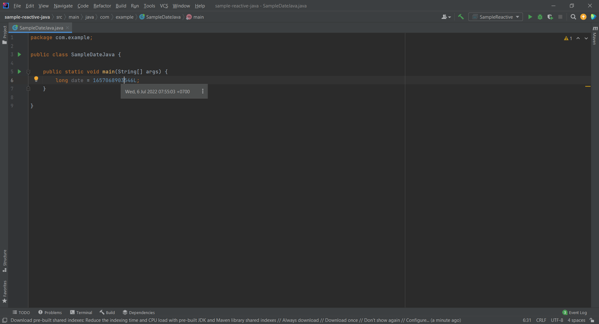
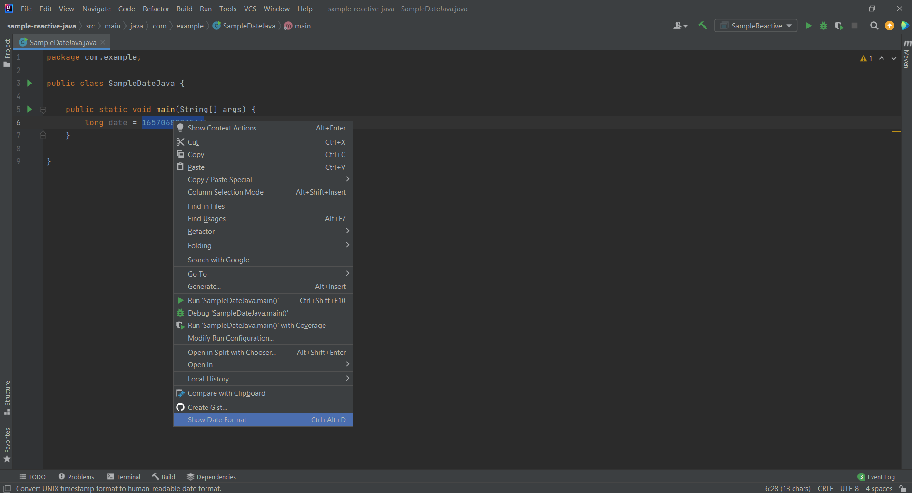
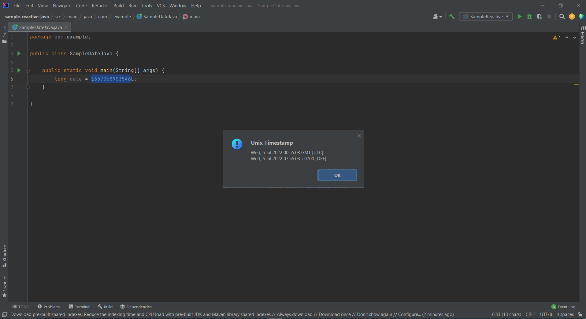
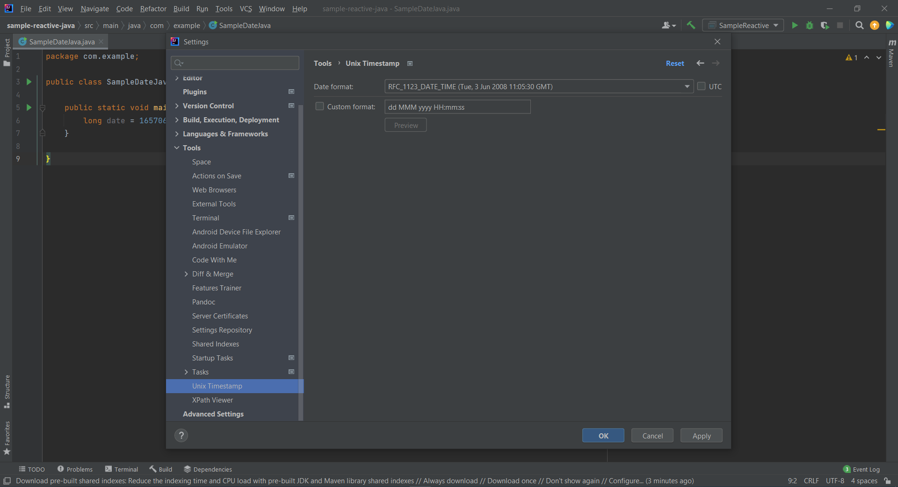

# unix-timestamp 
==================

IntelliJ plugin - https://plugins.jetbrains.com/plugin/19499

Convert UNIX timestamp format to human-readable date format.

A UNIX timestamp, also known as Epoch Time or POSIX timestamp, is a representation of a moment defined as the time that has elapsed since a reference known as the UNIX epoch: 1970-01-01 00:00:00 UTC.

