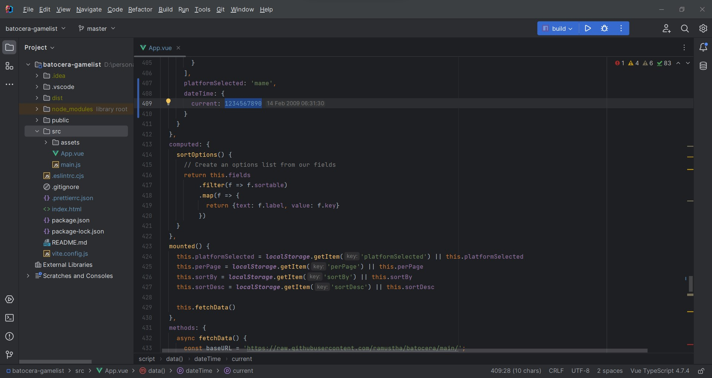
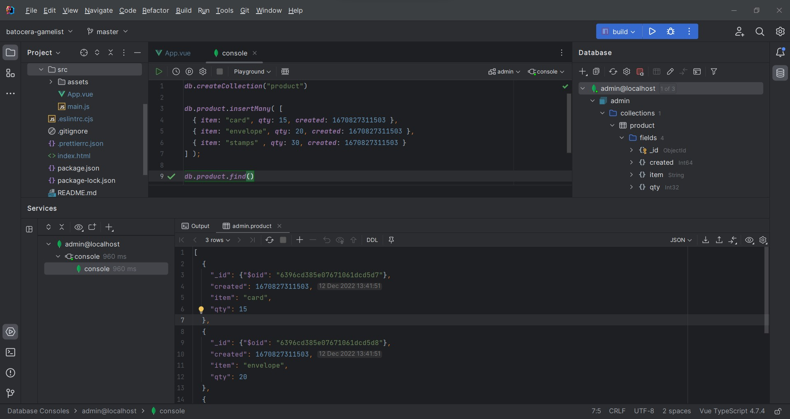
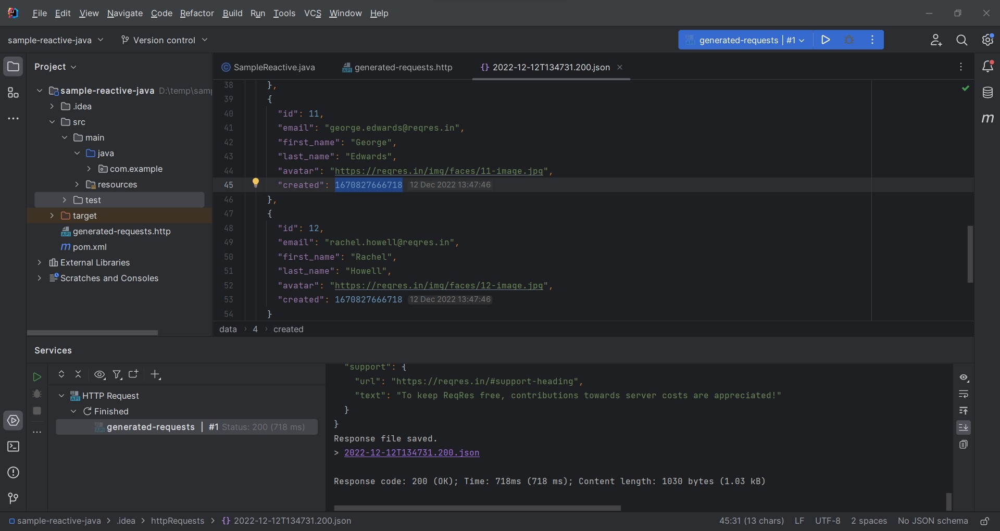
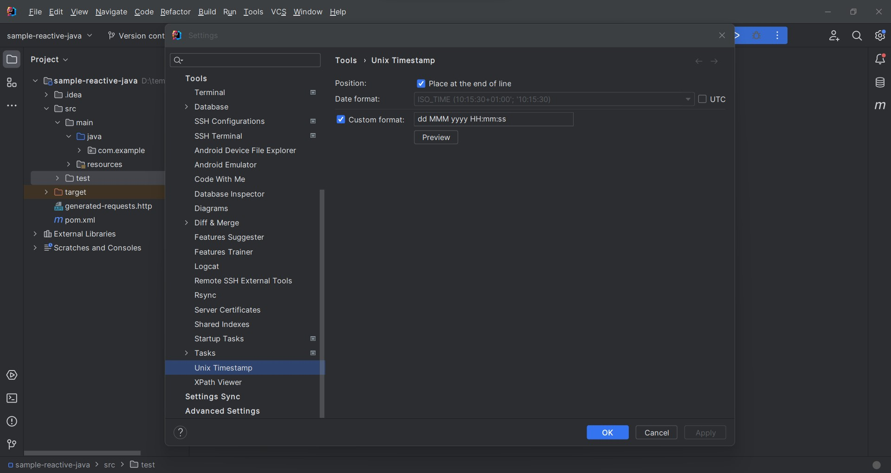

# UNIX Timestamp Converter

UNIX Timestamp Converter is a project that converts UNIX timestamp (also known as Epoch Time or POSIX timestamp), which is the representation of a moment defined as the time that has elapsed since a reference known as the UNIX epoch: 1970-01-01 00:00:00 UTC, to human-readable date format.

## Installation
* $ git clone https://github.com/ramustha/unix-timestamp.git 
* $ cd unix-timestamp
* $ ./gradlew runIde

## Usage
Pull requests are welcome. For major changes, please open an issue first to discuss what you would like to change.
Please insert correct instructions in **Usage** section and modify **Contributing** section if needed.
